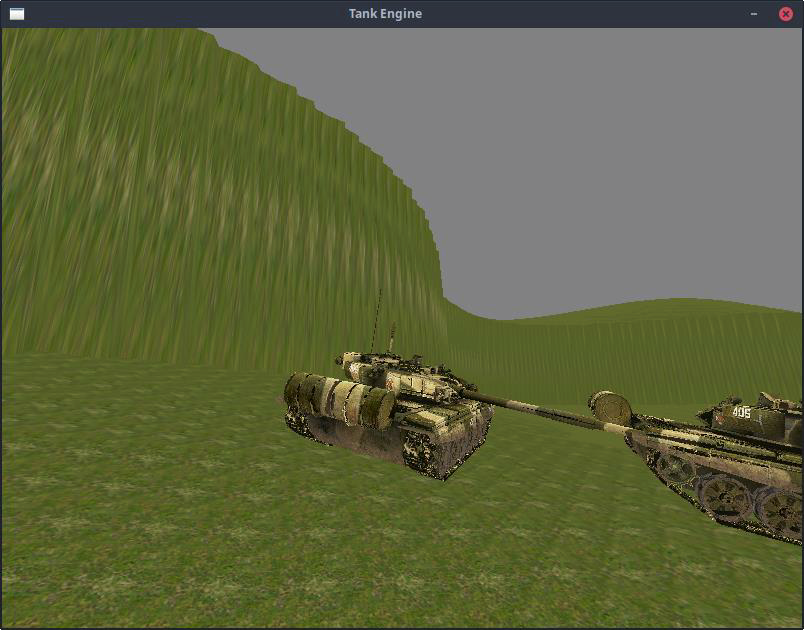

# ROS Tank Combat Simulator

---

A custom physics-based simulation engine for autonomous combat robots, featuring realistic sensor modeling, dynamic multi-agent coordination, and SLAM-based navigation. Built with ROS Noetic, Open Dynamics Engine, and raylib.

## Overview

Custom simulation framework for testing autonomous agent behaviors in adversarial environments. Each tank maintains an independent world representation derived from semi-realistic sensors (LIDAR, GPS, IMU, vision) and uses multi-layered planning for navigation and combat.

**Current Implementation:** Point capture game with autonomous tank agents competing in realistic terrain with physics simulation.

## Agent Capabilities

**Perception & Mapping:**
- 2.5D heightfield SLAM using LIDAR sensors
- Odometry and dead reckoning (GPS + IMU fusion)
- Real-time world model construction from sensor streams

**Navigation:**
- A* global path planning on SLAM-generated maps
- Vector Field Histogram (VFH) for dynamic obstacle avoidance
- Reactive Potential Field (RPF) local planning using LIDAR
- PID-controlled differential drive with independent throttle/brake per track

**Combat:**
- Heuristic reactive target acquisition
- PID-controlled turret aiming
- Computer vision-based target tracking

## Engine Features

**Physics Simulation:**
- Open Dynamics Engine integration for realistic tank dynamics
- Differential drive with per-track actuators
- Terrain heightfield collision and response
- Realistic weight, friction, and momentum

**Multi-Agent Architecture:**
- Dynamic ROS namespace generation for N agents
- Each agent runs independently with own sensor/actuator stack
- Generic serial sensor/actuator API for extensibility
- Custom Entity-Component-System for dynamic entity composition

**Sensor Array:**
- LIDAR (2.5D heightfield scanning)
- GPS (absolute positioning with configurable error)
- IMU (orientation and angular velocity)
- Simulated camera (target acquisition)
- All sensors loosely model real-world characteristics

**Visualization:**
- Real-time 3D rendering with raylib
- First-person and third-person camera modes
- Agent-targeted camera tracking
- Debug visualization for SLAM data and planning

## Architecture

**Simulation Engine (`tanksim_simulator`):**
- Runs physics simulation at fixed timestep
- Publishes sensor data to ROS topics per agent namespace
- Receives actuator commands and applies to physics bodies
- Manages game state and scoring

**Agent Controllers (`tanksim_controller`):**
- Subscribe to agent-specific sensor topics
- Maintain internal world representation (SLAM map)
- Execute planning hierarchy: global → local → reactive
- Publish actuator commands to simulation

**Planning Hierarchy:**
```
1. Global Planning (A*)
2. Local Planning (VFH + RPF)
3. Reactive Control (PID actuators)
```

## Tech Stack

- **ROS Noetic** - Multi-agent coordination and communication
- **Open Dynamics Engine** - Physics simulation
- **raylib** - 3D rendering and visualization
- **C++** - Core implementation

## Build Instructions

**Dependencies:**
- ROS Noetic
- raylib (CMake will search root and home directories)
- Open Dynamics Engine
```bash
# Build with catkin
cd <workspace>
catkin_make

# Source workspace
source devel/setup.bash
```

## Running the Simulator
```bash
# 1. Launch simulator
rosrun tanksim tanksim_simulator

# 2. Spawn tanks in simulator
#    Press 'X' in simulator window to create tank agents
#    Spawn as many as desired

# 3. Launch controllers (one per tank)
rosrun tanksim tanksim_controller  # Terminal 1
rosrun tanksim tanksim_controller  # Terminal 2
# ... repeat for each tank

# Controllers auto-assign to uncontrolled tanks
```

## Controls

- **X** - Spawn new tank agent
- **Z** - Toggle camera mode (first-person / third-person)
- **C** - Cycle camera target between agents

## Planned Features

**Perception:**
- Simulated sensor noise models
- Extended Kalman Filter for sensor fusion
- Combat memory for tracking sighted enemies
- Persistent enemy odometry

**Planning:**
- High-level tactical planning (GOAP or behavior trees)
- Team coordination through central control node
- LLM-based tactical reasoning (llama.cpp integration)
- Reinforcement learning for heuristic tuning (LibTorch)

**Multi-Agent Coordination:**
- Sensor data sharing protocols
- Formation control
- Cooperative tactics
- Role assignment (scout, assault, support)

**Engine:**
- Headless mode for training and batch simulations
- Performance metrics and logging
- Diverse terrain (trees, cliffs, buildings, water)
- Additional game modes
- Improved graphics pipeline

## Technical Challenges Solved

**Multi-Robot ROS Architecture:**
- Dynamic namespace generation enables arbitrary agent count
- Each controller independently discovers and claims uncontrolled agents
- Topic naming convention: `/tank_N/{sensor_name}`, `/tank_N/{actuator_name}`

**SLAM Implementation:**
- 2.5D heightfield representation for terrain awareness
- Real-time map updates from LIDAR sweeps
- Integration with A* planner for global navigation

**Layered Planning:**
- Global planning (A*) provides waypoints
- Local planning (VFH + RPF) handles dynamic obstacles
- Reactive control (PID) manages actuators
- Each layer operates at different timescales

**Physics Integration:**
- Custom sensor protocol interfaces with ODE physics state
- Realistic differential drive model with per-track control
- Sensor positions/orientations relative to tank body frame

## Performance Characteristics

- Physics simulation: Fixed timestep (configurable)
- Sensor update rates: Per-sensor configurable
- SLAM map resolution: Configurable grid size
- A* replanning: On map update or goal change
- VFH + RPF: High-frequency reactive control

## Future Research Directions

- Reinforcement learning for tactical decision-making
- Genetic algorithms for team strategy optimization
- LLM integration for high-level reasoning
- Multi-agent communication protocols
- Adversarial training environments

---

**Note:** Rapid prototyping project completed under time constraints. Code cleanup and refactoring planned for production use.
